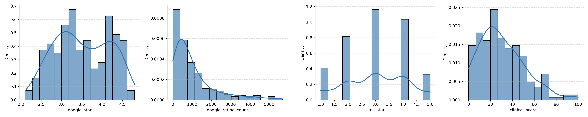
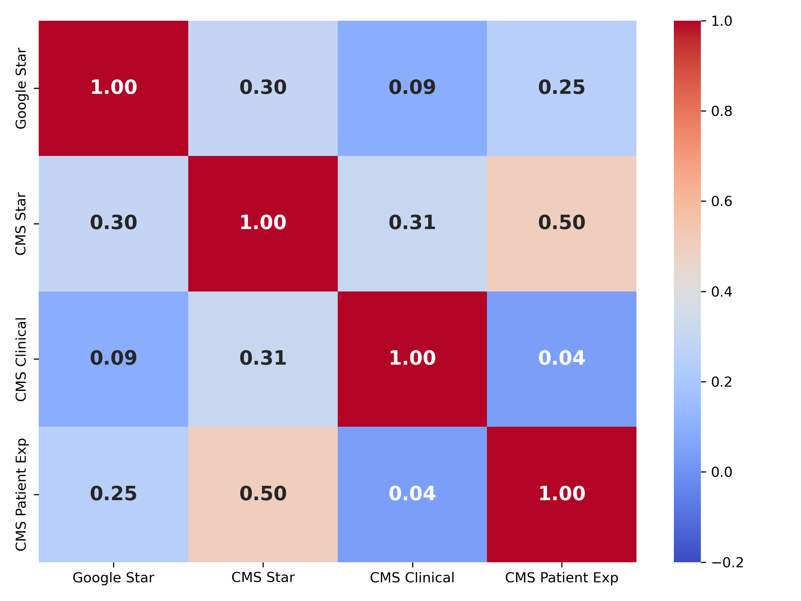
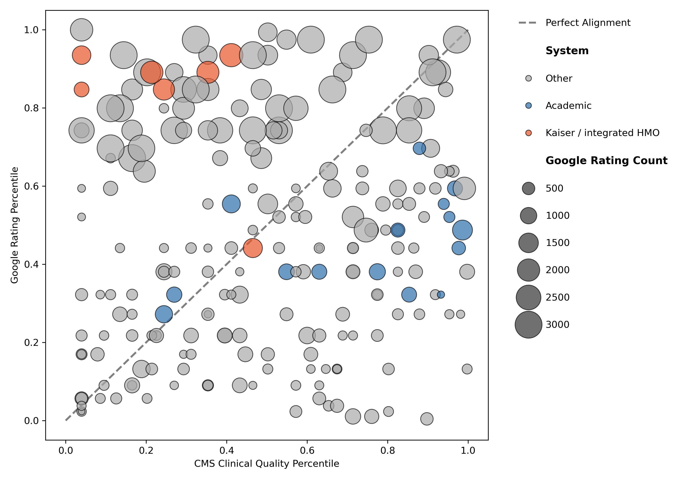
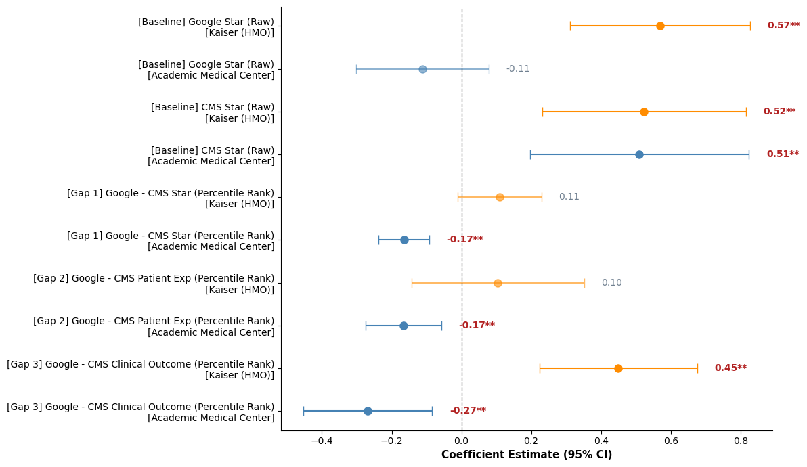
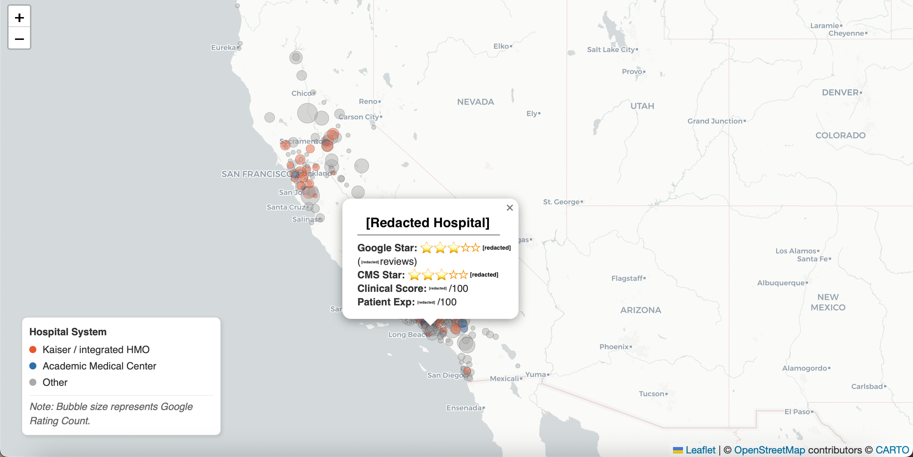

# Divergence Between Google Maps Reviews and CMS Hospital Ratings in California

| | |
|---|---|
| **Domain** | Healthcare analytics, public ratings |
| **Sample** | 239 California hospitals, 42 counties |
| **Methods** | Fuzzy entity matching, county-clustered OLS, nonparametric tests |
| **Stack** | Python · pandas · RapidFuzz · statsmodels · scikit-learn · folium|
| **Data sources** | Google Places API · CMS Hospital Compare · AHRQ SDOH · CMS POS File |
| **My role** | Entity resolution, preprocessing, statistical modeling, technical writing |

Google hospital ratings are widely used but rarely validated against clinical quality measures. This repository is a portfolio-focused reconstruction of a UC Davis STA 220 group project examining whether Google Maps hospital ratings align with official CMS hospital quality measures among California hospitals.

The final analytic sample included 239 California hospitals across 42 counties. The public version focuses on the analytical workflow I owned end-to-end: fuzzy entity matching, dataset merge, preprocessing and EDA, county-clustered OLS modeling, sensitivity analysis, and sanitized public visualization.

Raw Google API-derived records, row-level merged datasets, and teammate-authored notebooks are excluded from this public repository.

## My Contributions

This project was originally completed as a three-person UC Davis STA 220 course project. I owned the following components:

- **Entity resolution:** Built the initial Google Places API demo, built the ZIP3-constrained fuzzy matching pipeline (RapidFuzz) linking 250 CMS hospital records to Google Places entries, including geographic validation and a targeted re-query for incomplete Southern California coverage.
- **Statistical modeling**: Specified and estimated five county-clustered OLS models; conducted Spearman/Wilcoxon tests and two sensitivity analyses (Kaiser exclusion, Cook's distance).
- **Preprocessing**: Handled Kaiser clinical-score missingness as an MNAR institutional pattern; constructed AMC indicator; constructed percentile-rank gap outcomes. 
- **Technical writing:** rewrote the methodology, results, and discussion sections to correct statistical interpretation issues and align the final report with the actual analysis.

Collaborative components not included in this public reconstruction include the original Google API collection notebooks.

## Key Findings

- **Google ratings are not a reliable proxy for clinical quality.**  
  Google star ratings show weak alignment with CMS clinical quality scores, even though they are somewhat more aligned with CMS patient experience. This suggests that online ratings should not be used alone for clinical-quality interpretation.

- **Review volume behaves like a platform visibility signal.**  
  Hospitals with more Google reviews tend to rank higher on Google relative to CMS measures, while review count is not meaningfully associated with CMS overall stars. For analytics teams, this means review volume should be treated as a potential platform-exposure factor, not just a popularity metric.

- **Institutional subgroup patterns matter.**  
  Kaiser / integrated HMO hospitals and academic medical centers show different Google–CMS divergence patterns. This suggests that hospital type should be accounted for when comparing public-facing reputation with official quality metrics.

- **County-level vulnerability affects both systems, but does not explain the gap.**  
  Social vulnerability is negatively associated with both Google and CMS ratings, but it does not significantly widen the Google–CMS percentile gap. In this dataset, divergence is more closely associated with review volume and institutional subgroup patterns than with county-level SDOH alone.

Overall, online ratings appear to capture public-facing experience and visibility more than clinical quality. 

## Selected Public Outputs

Displayed outputs are aggregate or sanitized public artifacts; row-level hospital records and API-derived records are excluded from this repository.

### Rating Distributions



Four rating variables plotted separately. Scales and distributions differ across systems, motivating percentile-rank gap outcomes rather than raw-score comparison. 

### Spearman Correlation Heatmap



Spearman rank correlations between Google and CMS measures. Google star ratings show weak alignment with CMS clinical quality scores (ρ = 0.09).

### Google vs. CMS Clinical Percentile Gap Bubble Plot



Each point is one hospital. Points above the diagonal rank higher on Google than on CMS clinical quality. Bubble size reflects Google review count; color indicates institutional subgroup. 

### Coefficient Forest Plot



Coefficient estimates (95% CI) for Kaiser and Academic Medical Center indicators across five models. Both institutional types receive higher CMS overall stars, but diverge in gap-model direction.

### Redacted Interactive Map Preview



Interactive map showing hospital locations across California. Popup fields and hospital identifiers are redacted in this public preview screenshot.

## Repository Structure

```text
.
├── README.md
├── notebooks/
│   ├── 02_fuzzy_matching.ipynb
│   ├── 04_dataset_merge.ipynb
│   ├── 05_preprocessing_eda.ipynb
│   ├── 06_ols_modeling_sensitivity.ipynb
│   └── 07_interactive_map.ipynb
├── outputs/
│   ├── figures/
│   ├── tables/
│   └── maps/
├── data/
│   ├── README.md
│   └── data_dictionary.md
└── docs/
    └── methodology_notes.md
```

## Notebook Guide

| Notebook | Purpose |
|---|---|
| `02_fuzzy_matching.ipynb` | ZIP3-constrained fuzzy matching between CMS hospital names and Google place names, with geographic validation and manual review logic. |
| `04_dataset_merge.ipynb` | Final merge across Google-derived records, CMS quality files, AHRQ county SDOH indicators, and CMS POS teaching variables. |
| `05_preprocessing_eda.ipynb` | Exclusions, missing-data handling, Kaiser and academic flags, percentile ranks, nonparametric tests, and aggregate EDA figures. |
| `06_ols_modeling_sensitivity.ipynb` | County-clustered OLS models, coefficient plots, diagnostics, Kaiser exclusion sensitivity, and Cook's-distance sensitivity. |
| `07_interactive_map.ipynb` | Folium-based interactive map workflow. The row-level dataset and generated HTML map are excluded from the public repository. |

The notebooks are sanitized copies intended for workflow review. Outputs are cleared because row-level source data are excluded from the public repository.

## Data Availability

This repository does not include raw Google Places API outputs, API-derived row-level records, or the merged analytic dataset. See `data/README.md` for the public data policy and source categories.

The code is provided for portfolio review and methodological transparency. Reproduction would require separately obtained source data and local reconstruction of the excluded intermediate datasets.

## Limitations

- California-only sample; institutional patterns may not generalize to other states.
- Cross-sectional design; Google ratings and CMS measures do not necessarily reflect identical time windows.
- Google reviewers are self-selected and may not represent the full patient population.
- Subgroup estimates for academic medical centers and the Kaiser / integrated HMO marker should be interpreted cautiously because subgroup sizes are limited.
- All associations are descriptive; this project does not make causal claims.

## Tools

Python, pandas, NumPy, RapidFuzz, statsmodels, scipy, scikit-learn, matplotlib, seaborn, folium.
