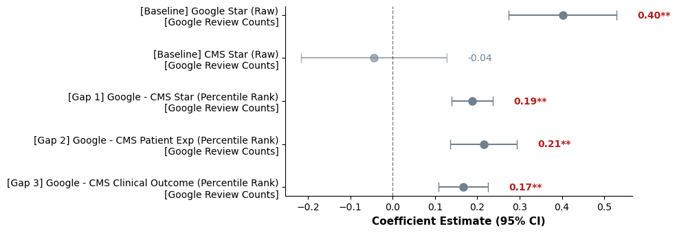
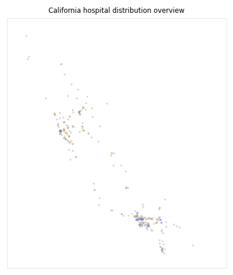

# Divergence Between Google Maps Reviews and CMS Hospital Ratings in California

This repository is a portfolio-focused reconstruction of a UC Davis STA 220 group project examining whether Google Maps hospital star ratings align with official CMS hospital quality measures in California.

The public version highlights the components I independently implemented and can fully explain: fuzzy entity matching, final dataset merge, preprocessing and EDA, OLS modeling, and sensitivity analysis.

Raw API-derived data and some collaborative notebooks are not included because of data-sharing constraints and contribution-boundary considerations. This repository is intended to demonstrate the analytical workflow and selected aggregate outputs, not to provide full raw-data reproducibility.

## Project Snapshot

- **Domain:** Healthcare analytics, public ratings, hospital quality measurement
- **Sample:** 239 California hospitals after analytic exclusions
- **Data sources:** Google Places API, CMS Hospital Compare, AHRQ SDOH Database, CMS Provider of Services File
- **Methods:** Entity resolution, fuzzy matching, feature engineering, nonparametric tests, county-clustered OLS, sensitivity analysis
- **Public-data boundary:** No raw Google API outputs or row-level merged analytic data are included

## My Contribution

This project was originally developed in a three-person team. My primary contributions were:

- Designed and implemented the fuzzy entity matching pipeline using ZIP3-constrained candidate generation, RapidFuzz scoring, and ZIP5 geographic validation.
- Diagnosed the Southern California matching gap as an upstream Google Places API pagination/completeness issue rather than a fuzzy matching failure.
- Built the final analytic dataset merge and preprocessing workflow.
- Constructed key modeling variables, including Kaiser and academic medical center indicators, percentile-rank gap outcomes, and standardized SDOH covariates.
- Implemented Spearman correlation analysis, Wilcoxon signed-rank test, county-clustered OLS models, and Kaiser/Cook's-distance sensitivity analyses.
- Produced most statistical figures and revised the methodology/results sections for consistency.

Collaborative components not included in this public reconstruction include the original Google API collection notebooks and the original teammate-authored interactive folium map.

## Key Findings

The result wording below follows the final project report and is intentionally descriptive rather than causal.

- Google ratings were only weakly associated with CMS clinical outcome scores (Spearman rho = 0.091), while showing modest association with CMS patient experience scores (rho = 0.246).
- Google and CMS overall star ratings differed systematically in the matched sample (mean difference = 0.49 stars; Wilcoxon signed-rank p < 0.0001).
- Standardized log Google review count was strongly associated with Google ratings and all three Google-minus-CMS percentile gap outcomes, while it was not statistically associated with CMS overall stars.
- Social vulnerability was negatively associated with both Google and CMS ratings, but it was not significantly associated with the gap outcomes.
- Institutional subgroup markers were associated with different patterns of divergence, especially in the clinical gap model.

The Kaiser indicator captures a structurally distinct integrated HMO system in California, where CMS clinical reporting patterns differ from many non-Kaiser hospitals. This variable is interpreted as a descriptive institutional subgroup marker rather than a causal estimate of HMO integration.

## Selected Aggregate Outputs

Displayed outputs are aggregate or sanitized public artifacts; row-level hospital records and API-derived records are excluded from this repository.

### Rating Distributions


### Spearman Correlation Heatmap


### Review Count Coefficients



### Institutional Subgroup Coefficients


### Statewide Map Overview

This small static image is included only as a coarse geographic overview. It intentionally excludes labels, tooltips, tables, and readable hospital-level details.



## Repository Structure

```text
.
├── README.md
├── AGENTS.md
├── notebooks/
│   ├── 02_fuzzy_matching.ipynb
│   ├── 04_dataset_merge.ipynb
│   ├── 05_preprocessing_eda.ipynb
│   └── 06_ols_modeling_sensitivity.ipynb
├── outputs/
│   ├── figures/
│   ├── tables/
│   └── maps/
├── data/
│   ├── README.md
│   └── data_dictionary.md
└── docs/
    └── methodology_notes.md
```

## Notebook Guide

| Notebook | Purpose |
|---|---|
| `02_fuzzy_matching.ipynb` | ZIP3-constrained fuzzy matching between CMS hospital names and Google place names, with geographic validation and manual review logic. |
| `04_dataset_merge.ipynb` | Final merge across Google-derived records, CMS quality files, AHRQ county SDOH indicators, and CMS POS teaching variables. |
| `05_preprocessing_eda.ipynb` | Exclusions, missing-data handling, Kaiser and academic flags, percentile ranks, nonparametric tests, and aggregate EDA figures. |
| `06_ols_modeling_sensitivity.ipynb` | County-clustered OLS models, coefficient plots, diagnostics, Kaiser exclusion sensitivity, and Cook's-distance sensitivity. |

The notebooks are sanitized copies intended for workflow review. Outputs are cleared because row-level source data are excluded from the public repository.

## Data Availability

This repository does not include raw Google Places API outputs, API-derived row-level records, or the merged analytic dataset. See `data/README.md` for the public data policy and source categories.

The code is provided for portfolio review and methodological transparency. Reproduction would require separately obtained source data and local reconstruction of the excluded intermediate datasets.

## Limitations

- California-only sample; institutional patterns may not generalize to other states.
- Cross-sectional design; Google ratings and CMS measures do not necessarily reflect identical time windows.
- Google reviewers are self-selected and may not represent the full patient population.
- Subgroup estimates for academic medical centers and the Kaiser / integrated HMO marker should be interpreted cautiously because subgroup sizes are limited.
- All associations are descriptive; this project does not make causal claims.

## Tools

Python, pandas, NumPy, RapidFuzz, statsmodels, scipy, scikit-learn, matplotlib, seaborn.
